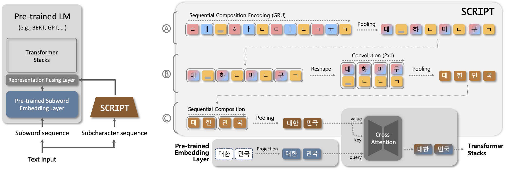

# SCRIPT: A Subcharacter Compositional Representation Injection Module for Korean Pre-Trained Language Models

This paper is accepted to **_ACL 2026 Findings_**.<br/>
**_SungHo Kim_**, Juhyeong Park, Atalay Eda, SangKeun Lee

<br/>


SCRIPT is a lightweight, plug-and-play module that injects Korean subcharacter compositional knowledge into pre-trained language models without modifying their original architectures and from scratch pre-training.




<br/>

*This repository is currently under review.* <br/>
- *Dataset for Character Tagging Analysis (for Section 2. Motivation) is released [here](https://drive.google.com/file/d/1fdorgYVFhpdXFtZVmDd7dX5Bvj9NlDgE/view?usp=sharing).* <br/>
- *BERT and KOMBO pre-trained models are released [here](https://drive.google.com/file/d/14rntFZ6GGKFbijhm3OftzffPmPrbRh84/view?usp=sharing).* <br/>
  *(Other baselines are obtained from HuggingFace* 🤗 *)* <br/>
<br/>
<br/>


## Environments

Install the required packages as follows:

  1. Clone this repository.
        
  2. Create and activate a Conda environment.
  
      ```
      cd SCRIPT
      
      conda env create -f environment.yml -n [env_name]
      conda activate [env_name]
      ```
      
  3. Install remaining dependencies.
      
      ```
      conda install mpi4py -y

      python -m pip install --upgrade pip setuptools wheel
    
      pip uninstall torch torchvision torchaudio -y
      pip install torch==2.4.1 torchvision==0.19.1 torchaudio==2.4.1 --index-url https://download.pytorch.org/whl/cu121
      ```
<br/>


## NLU Tasks

#### BERT-base (+ **SCRIPT**)
  ```
  CUDA_VISIBLE_DEVICES=0 python KOMBO/nlu_tasks/scripts/run_finetuning.py --model_name bert-base \
  --tok_type morphemeSubword --tok_vocab_size 32k \
  --save_dir KOMBO/logs/bert-base/morphemeSubword_ko_wiki_32k/pretraining/128t_128b_1s_5e-05lr_42rs/ckpt \
  --set_lora False --set_script True \
  --lr_scheduler linear --task_name $TASK --learning_rate 5e-05 --random_seed 1
  ```
    
#### KOMBO-base
  ```
  CUDA_VISIBLE_DEVICES=0 python KOMBO/nlu_tasks/scripts/run_finetuning.py --model_name kombo-base \
  --tok_type jamo_distinct --tok_vocab_size 200 \
  --save_dir KOMBO/logs/kombo-base/jamo_distinct_ko_200/pretraining/span-character-mlm_jamo-trans3_gru_conv1-cjf_repeat_gru-up-res_128t_128b_1s_5e-05lr_42rs/ckpt \
  --set_lora False --set_script True \
  --lr_scheduler linear --task_name $TASK --learning_rate 1e-04 --random_seed 1 
  ```

#### KoGPT2-base (+ **SCRIPT**)
  ```
  CUDA_VISIBLE_DEVICES=0 python nlu_tasks/scripts/run_llm_finetuning.py --model_name skt/kogpt2-base-v2 \
  --compile False --deepspeed False --lora False \
  --set_script True --script_tok_type jamo_var --script_do_combination True --script_combination_type gru --script_fusion cross_attn \
  --task_name $TASK
  ```
  
#### KoGPT3-1.2B (+ **SCRIPT**)
  ```
  CUDA_VISIBLE_DEVICES=0 python nlu_tasks/scripts/run_llm_finetuning.py --model_name skt/ko-gpt-trinity-1.2B-v0.5 \
  --compile False --deepspeed False --lora True \
  --set_script True --script_tok_type jamo_var --script_do_combination True --script_combination_type gru --script_fusion cross_attn \
  --task_name $TASK
  ```
  
#### EXAONE-2.4B (+ **SCRIPT**)
  ```
  CUDA_VISIBLE_DEVICES=0 python nlu_tasks/scripts/run_llm_finetuning.py --model_name LGAI-EXAONE/EXAONE-3.5-2.4B-Instruct \
  --compile False --deepspeed False --lora True \
  --set_script True --script_tok_type jamo_var --script_do_combination True --script_combination_type gru --script_fusion cross_attn \
  --task_name $TASK
  ```
  
#### Configuration Options
  - `task_name` <br/>
  : KorNLI, KorSTS, NSMC, PAWS_X, KB_BoolQ, KB_Wic, KB_COPA, KB_HellaSwag, KB_SentiNeg
  - `tok_type` *(Available for BERT)* <br>
  : stroke, cji, bts, jamo_var, jamo_distinct (only for KOMBO), char, morpheme, subword, morphemeSubword, word
  - `set_script` *(Enable the SCRIPT module during fine-tuning)* <br/>
  : True/ False
  - `script_tok_type` <br/>
  : jamo_var, stroke, cji, bts
  - `script_fusion` <br/>
  : cross_attn, sum, concat
  
<br/>


## NLG Tasks

#### KoGPT2-base (+ **SCRIPT**)
  ```
  CUDA_VISIBLE_DEVICES=0 python nlg_tasks/scripts/run_llm_finetuning.py --model_name skt/kogpt2-base-v2 \
  --compile False --deepspeed False --lora False \
  --set_script True --script_tok_type jamo_var --script_do_combination True --script_combination_type gru --script_fusion cross_attn \
  --task_name $TASK
  ```
  
#### KoGPT3-1.2B (+ **SCRIPT**)
  ```
  CUDA_VISIBLE_DEVICES=0 python nlg_tasks/scripts/run_llm_finetuning.py --model_name skt/ko-gpt-trinity-1.2B-v0.5 \
  --compile False --deepspeed False --lora False \
  --set_script True --script_tok_type jamo_var --script_do_combination True --script_combination_type gru --script_fusion cross_attn \
  --task_name $TASK
  ```
  
#### EXAONE-2.4B (+ **SCRIPT**)
  ```
  CUDA_VISIBLE_DEVICES=0 python nlg_tasks/scripts/run_llm_finetuning.py --model_name LGAI-EXAONE/EXAONE-3.5-2.4B-Instruct \
  --compile False --deepspeed False --lora True \
  --set_script True --script_tok_type jamo_var --script_do_combination True --script_combination_type gru --script_fusion cross_attn \
  --task_name $TASK
  ```

#### Configuration Options
  - `task_name` <br/>
  : KoCommonGen, XL_Sum, KoreanGEC_korean_learner, KoreanGEC_native
  - `set_script`  *(Enable the SCRIPT module during fine-tuning)* <br/>
  : True/ False
  - `script_tok_type` <br/>
  : jamo_var, stroke, cji, bts
  - `script_fusion` <br/>
  : cross_attn, sum, concat

<br/>
